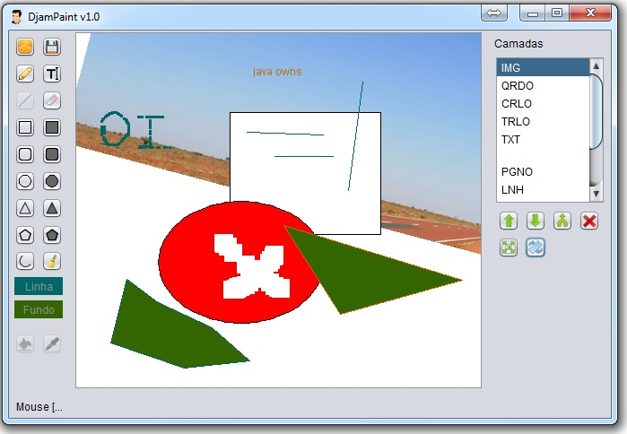

paint
=====

Trabalho feito para a disciplina de Computação Gráfica no curso de Ciência da Computação na Universidade de Itaúna.

O objetivo do trabalho é aprender mais sobre como é manipulado imagens, vetores, quadradros na computação, foram estudados quais os calculos para deslocar, rotacionar imagens, shapes, e afins, logo após foi orientado a construção de um editor de imagens simples afim de se aprender mais sobre.

Este editor foi construido em Java 6 e contêm recursos diversos como podem ser encontrados na imagem abaixo.

